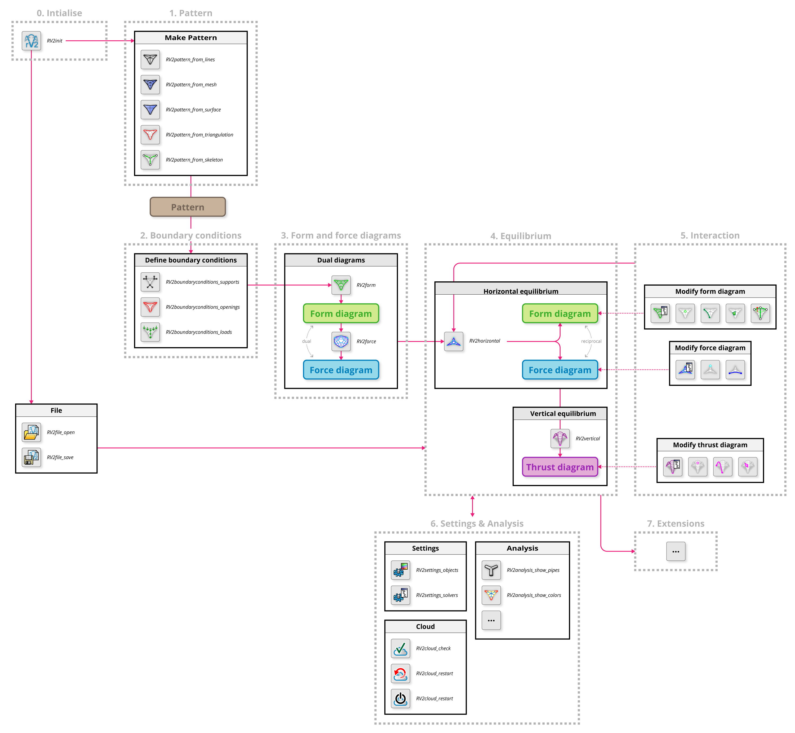

.. _manual:

********************************************************************************
User manual
********************************************************************************

The RV2 workflow can be broken down into six main steps.
The details of the six steps, including the basic principles, implementation methodology and various parameters, will be described in this section.

.. toctree::
   :maxdepth: 2
   :titlesonly:
   :glob:

   manual/00_initialising.rst
   manual/01_pattern.rst
   manual/02_boundary_conditions.rst
   manual/03_diagrams.rst
   manual/04_equilibrium.rst
   manual/05_interaction.rst
   manual/06_settings.rst
   manual/07_extensions.rst
