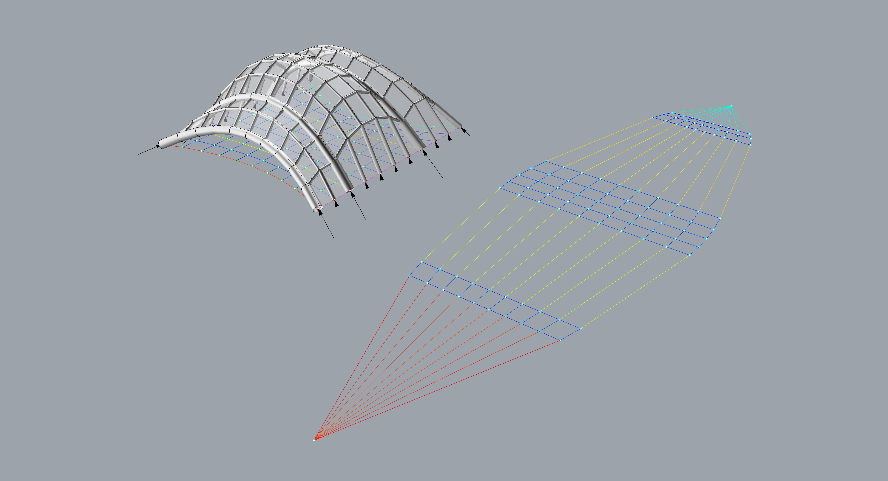
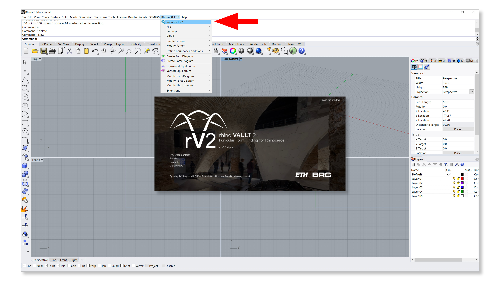
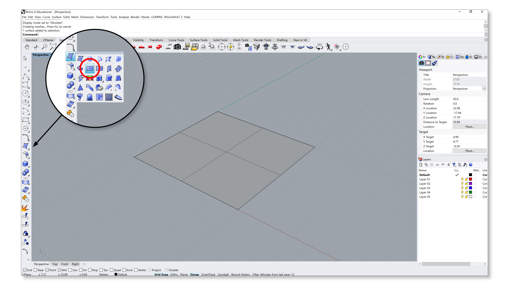
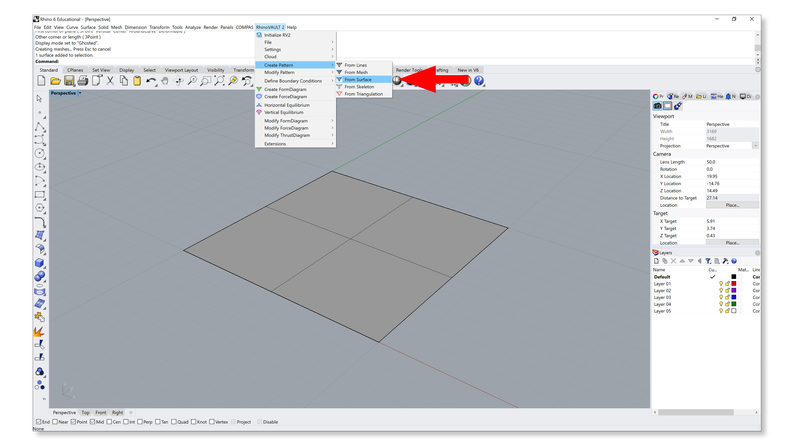
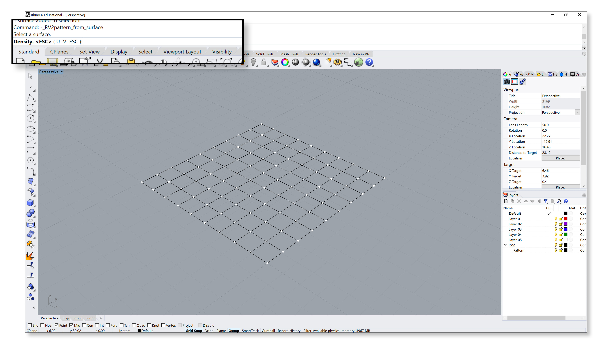

================================================================================
Tutorial
================================================================================

This section provides a step-by-step tutorial of a simple tutorial, highlighting and describing the main features of RV2. This tutorial is intended to be a "quick start" guide to RV2. For further information about the procedures, methods and various parameters involved in each of the steps, please refer to the :ref:`manual`.

0. Initialising
===============

This first step initiates the RV2 engine, imports all the relevant packages and activates compas_cloud server. The startup window also provides various links to useful information, such as the online documentation, tutorials, the repository and terms of use. By clicking "YES," you acknowledge that you have read and understood the Terms and Conditions, and the Data Donation Agreement.

1. Pattern
==========

A ``Pattern`` is a collection of lines that define the topology of the form diagram. In this step, the user can create a pattern from: a network of Rhino lines; a Rhino mesh object; a Rhino NURBS surface object; or a skeleton; or a set of boundary features (tri-mesh from Delaunay triangulation or quad-mesh from ``compas_pattern``).

In this tutorial, we will use a simple orthogonal surface, which can be created through the Rhino command, "Rectangular plane: corner to corner." By choosing two corners, create a planar surface that is a square in plan.

In the RhinoVAULT 2 drop down menu, select "Create Pattern", then "From Surface." Select the the surface in the viewport.

This command will generate a ``Pattern`` from the input surface, using the UV mapping of the surface. The user has the option to enter values for "U" and "V." For this tutorial, we keep the U and V to their default values of 10.

2. Boundary conditions
======================

Once a ``Pattern`` object has been generated, the boundary conditions will need to be defined. In RV2, the boundary conditions include: 1) identifying the supports (vertices of the structure where reactions are allowed); 2) defining and updating the openings; and 3) loading parameters and conditions.

1.  **Identify supports**

    In the RhinoVAULT 2 drop down menu, select "Define Boundary Conditions", then "Identify Supports."

    .. figure:: _images/tutorial_5.jpg
        :figclass: figure
        :class: figure-img img-fluid

    The command will provide two options, to "Select" or "Unselect" vertices to define them as supports or not. The vertex selection modes are:

    * *AllBoundaryVertices* - all boundary vertices
    * *Corners* - all corner vertices (only works for quad-meshes)
    * *ByContinuousEdges* - all vertices on the selected boundary edge from corner to corner (only works for quad-meshes)
    * *Manual* - manual selection by the user

    .. figure:: _images/tutorial_6.jpg
        :figclass: figure
        :class: figure-img img-fluid

    In this tutorial, we use the mode *ByContinuousEdges*, and select one edge on the left boundary and on edge on the right boundary of the pattern. Once the two edges are selected, press Enter, then all the vertices along that boundary from corner to corner, will be automatically selected (supports are shown in red).

    .. figure:: _images/tutorial_7.jpg
        :figclass: figure
        :class: figure-img img-fluid

2.  **Update openings**

    The second step of defining boundary conditions involves updating the geometry of the openings. In this tutorial, the two boundaries at the top and the bottom are the openings (the edges are on the boundary of the pattern but have no support vertices along them).

    Because openings have no supports (i.e. reaction or external forces), they cannot be straight (unless the non-boundary edges at the openings have no internal forces in them, as in a cross vault or a barrel vault); openings need to curve inward towards the center of the Pattern, so that horizontal equilibrium can be resolved.

    In the RhinoVAULT 2 drop down menu, select "Define Boundary Conditions", then "Update Openings."

    .. figure:: _images/tutorial_8.jpg
        :figclass: figure
        :class: figure-img img-fluid

    If there are straight openings found in the pattern, an automatic sag of 5% of the span of the opening will be imposed. Per opening, the user has the option to enter a desired amount of sag, as a percentage of the span of the opening.

    .. figure:: _images/tutorial_9.jpg
        :figclass: figure
        :class: figure-img img-fluid

    In this tutorial, sag of 10% is applied to opening 1, and sag of 20% is applied to opening 0.

    .. figure:: _images/tutorial_10.jpg
        :figclass: figure
        :class: figure-img img-fluid

3.  **Define Loads**

    This feature is not presented in this tutorial.

3. Form and force diagrams
==========================

1.  **Create form diagram**

    Once the boundary conditions have been defined, the ``Pattern`` can now be converted into a ``FormDiagram``.

    In the RhinoVAULT 2 drop down menu, select "Create FormDiagram."

    .. figure:: _images/tutorial_11.jpg
        :figclass: figure
        :class: figure-img img-fluid

    If the creation of ``FormDiagram`` is successful, it will be displayed with green vertices and edges. The ``ThrustDiagram`` is also automatically created (displayed in magenta), the geometry of which is equivalent to the ``FormDiagram`` at this initial, un-equilibrated state.

    .. figure:: _images/tutorial_12.jpg
        :figclass: figure
        :class: figure-img img-fluid

2.  **Create force diagram**

    Once the ``FormDiagram`` has been created, the ``ForceDiagram`` can now be created.

    In the RhinoVAULT 2 drop down menu, select "Create ForceDiagram."

    .. figure:: _images/tutorial_13.jpg
        :figclass: figure
        :class: figure-img img-fluid

    The ``ForceDiagram`` will be automatically drawn to the right (+x) of the ``FormDiagram``. The initial ForceDiagram is the topological dual of the ``FormDiagram``. The two diagrams are not yet reciprocal, meaning that the corresponding edges in the diagrams are not perpendicular to the other.

    When the diagrams are not yet reciprocal (in another words, perpendicular-ised or "equilibrated"), the edges with angle deviations above the defined angle tolerance will be displayed. The dots displaying the angle deviations are visual cues for the user, indicating that horizontal equilibrium has not yet been resolved.

    .. figure:: _images/tutorial_14.jpg
        :figclass: figure
        :class: figure-img img-fluid

4. Equilibrium
==============

1.  **Horizontal equilibrium**

    Once the ``FormDiagram`` and ``ForceDiagram`` have been created, the horizontal equilibrium algorithm perpendicular-ises either or both diagrams, which converts them from dual to reciprocal diagrams.

    In the RhinoVAULT 2 drop down menu, select "Horizontal Equilibrium."

    .. figure:: _images/tutorial_15.jpg
        :figclass: figure
        :class: figure-img img-fluid

    Under "alpha" option, the user will be able to select a value that determine which of the two diagrams will have more weight during the perpendicular-isation process. Default is "form100," which only allows the ForceDiagram to update in its geometry. User can also enter the numnber of iterations. Default number of iterations is 100.

    .. figure:: _images/tutorial_16.jpg
        :figclass: figure
        :class: figure-img img-fluid

    If horizontal equilibrium has been found, meaning that all the corresponding edges now have angle deviations that are below the defined angle tolerance, the two diagrams should no longer have any dots displaying the angle deviation values, as shown below.

    .. figure:: _images/tutorial_17.jpg
        :figclass: figure
        :class: figure-img img-fluid

2.  **Vertical equilibrium**

    With the ``FormDiagram`` and ``ForceDiagram`` now reciprocal, the coordinates of the ``ThrustDiagram`` can be iteratively computed based on a desired *target height* value.

    In the RhinoVAULT 2 drop down menu, select "Vertical Equilibrium."

    .. figure:: _images/tutorial_18.jpg
        :figclass: figure
        :class: figure-img img-fluid

    The user can manually enter a desired value for the target height of the vault, and the number of iterations for the algorithm. Default number of iterations is 100.

    .. figure:: _images/tutorial_19.jpg
        :figclass: figure
        :class: figure-img img-fluid

    If the vertical equilibrium is successfully computed and found, the new ``ThrustDiagram`` will be displayed, now with updated z coordinates.

    .. figure:: _images/tutorial_20.jpg
        :figclass: figure
        :class: figure-img img-fluid

5. Interaction
==============

RV2 provides various post-form-finding functionalities to interact with the three diagrams (``FormDiagram``, ``ForceDiagram`` or the ``ThrustDiagram``) to explore various design options and parameters. In this tutorial, the geometry of the ``ForceDiagram`` will be modified to control the geometry of the FormDiagram.

1.  **Modify form diagram**

    The vertices of the form diagram can be fixed, and edges can be constrained to remain fixed in its length. The faces of the form diagram can also be used to toggle openings.

    These features will not be presented in this tutorial.

2.  **Modify force diagram**

    One of the most powerful features of TNA is the user's ability to control the form by constraining and interacting with the force iagram. The user can fix vertices, constrain edge lengths (which sets bounds on the minimum and maximum horizontal forces in the corresponding memebers), and move vertices to manually manipulate the force distribution in the thrust diagram.

    In the RhinoVAULT 2 drop down menu, select "Modify ForceDiagram" then "Move vertices."

    .. figure:: _images/tutorial_21.jpg
        :figclass: figure
        :class: figure-img img-fluid

    The vertices can be selected by edges and its chain of continuous edges, or manually. Select manual. Select a group of vertices in the top part of the ForceDiagram, and move it up in +y direction.

    .. figure:: _images/tutorial_22.jpg
        :figclass: figure
        :class: figure-img img-fluid

    The geometry of the ForceDiagram have been updated, but the FormDiagram and ``ForceDiagram`` are no longer in horizontal equilibrium, indicated by the angle deviations. Run "Horizontal Equilibrium" again, to perpendicular-ise the two diagrams again.

    .. figure:: _images/tutorial_23.jpg
        :figclass: figure
        :class: figure-img img-fluid

    With the ``FormDiagram`` and ``ForceDiagram`` in horizontal equilibrium, run "Vertical equilibrium" to compute the new geomerty of the ``ThrustDiagram``. Notice now, the crease in the ``ThrustDiagram``, which corresponds to the longer edges in the ``ForceDiagram``, where the internal member forces are greater.

    .. figure:: _images/tutorial_24.jpg
        :figclass: figure
        :class: figure-img img-fluid

    This modification funcationality can be applied repeatedly to continue force-driven form finding.

    .. figure:: _images/tutorial_25.jpg
        :figclass: figure
        :class: figure-img img-fluid

6. Settings & Analysis
======================

1.  **Settings**

    Under "Settings," then "Object settings," various global parameters and visualisations options can be moidified.

    .. figure:: _images/tutorial_26.jpg
        :figclass: figure
        :class: figure-img img-fluid

2.  **Analysis**

    Under "Analysis" in the drop down menu, there are several helper functions that facilitate analysis and enhance visualisation.

    "Color Analysis" draws the edges of the ``ForceDiagram`` with a color gradient from blue, green to red, based on its the length (the horizontal force in the corresponding edge of the ``ThrustDiagram``). The corresponding edges in the FormDiagram are also displayed with the same color, which makes the two diagrams much more legible and discernable (blue means smaller horizontal force, red means greater horizontal force).

    .. figure:: _images/tutorial_27.jpg
        :figclass: figure
        :class: figure-img img-fluid

    With "Display Pipes," the edges of the ``ThrustDiagram`` can be visualised with pipes, the radii of which are proportional to the internal forces.

    .. figure:: _images/tutorial_28.jpg
        :figclass: figure
        :class: figure-img img-fluid

7. Extensions
=============

RV2, which is based on the COMPAS framework, offers a flexible and robust platform to integreate other computational methods into the form finding workflow, such as best-fit TNA analysis, laod-path optimisation and various other fabrication-related applications.

Currently under construction.
